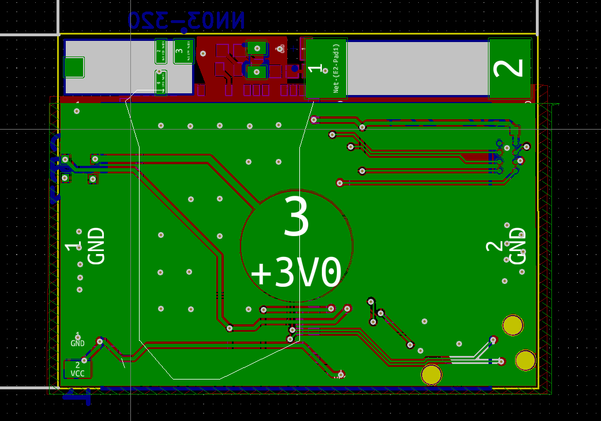

# NRF9160-Tracker
This is hardware project concept of a CR2032 Operated small size LTE-M/NB-Iot GPS tracker 19x26mm

##Reason
We created these designs and products for our company www.menura.org If you are in need of custom hardware, software and or solutions that provided digital insights please contact us at contact@menura.org 

For us, it's one of those products that would be pretty cool to make but hard to market since next to the hardware. You will need to provide a back end and front end with adequate independent hosting. Most tracking providers operate on central servers which they own. They as sellers are fully capable of tracking your assets. It doesn't sound all that fun if you realize anyone working at those companies in the right position is fully capable of tracking you and your assets as well if not better than you can.

##Notes
This is a design in concept. We have never produced this we are 80% sure this should work as is but still have some things to keep in mind

1. The antenna design is based on the recommendations of Ignion for EU-based operation. But it is a bit more cramped than they would like. We are unsure of RF performance and are not RF engineers by any means. We are pretty sure it should work fine we have seen far worse designs in production that work just fine.
2. It's a passive GPS antenna but again design is followed. Unsure of performance
3. It's a CR2032 battery-based product. Don't expect this to last multiple years. But with proper programming and battery optimization which the NRF9160 allows for it should be able to do just fine I expect 30 days at the least.
4. It's small compromises have been made, and programming is done with a tag connected 6 pin. Debug can be done over those ports either by UART or J-link based debug named RTT. Power is always provided by a battery or external power source threw battery pads.
5. The pads of the battery have shrunken because of 2 layer design this shouldn't be a problem but maybe it could cause some interference on trace running just below it. but those traces aren't that sensitive. 
6. Last thing that is pretty major we are using a 5V LDO that should be able to step up the voltage from the 3V that is received by the battery. Per spec, it should be able to do that just fine but sometimes they don't match the spec.

